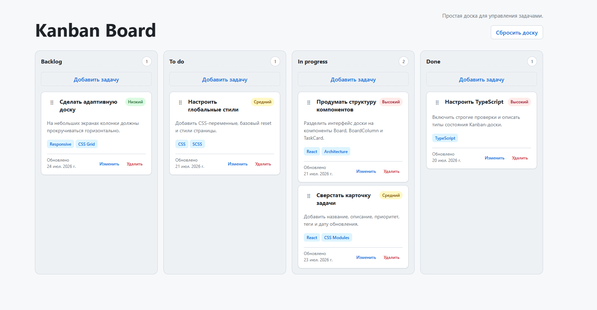

# Kanban Board

Учебная Kanban-доска для управления задачами. Приложение позволяет создавать, редактировать, удалять и перемещать задачи между колонками, а также сохраняет состояние в браузере.

<div align="center">


</div>

## Демо

[Открыть приложение](https://kanban-board-topaz-psi.vercel.app)

## Скриншот



## Возможности

- создание задач в выбранной колонке;
- редактирование названия, описания, приоритета и тегов;
- удаление задач;
- изменение порядка задач внутри колонки;
- перенос задач между колонками;
- перенос задач в пустые колонки;
- управление drag-and-drop мышью, touch и клавиатурой;
- валидация формы;
- сохранение состояния в `localStorage`;
- восстановление состояния после перезагрузки страницы;
- проверка сохранённых данных через Zod;
- сброс доски до демонстрационного состояния;
- адаптивная вёрстка;
- доступные названия, роли и элементы управления;
- автоматические unit-, component- и E2E-тесты;
- автоматические проверки через GitHub Actions.

## Колонки доски

Доска содержит четыре колонки:

1. `Backlog`
2. `To do`
3. `In progress`
4. `Done`

## Стек

### Основной

- React
- TypeScript
- Vite
- Zustand
- React Hook Form
- Zod
- dnd-kit
- SCSS
- CSS Modules
- clsx

### Тестирование

- Vitest
- React Testing Library
- Testing Library User Event
- jest-dom
- Playwright
- jsdom

### Инструменты

- ESLint
- Prettier
- GitHub Actions
- Vercel

## Архитектура

Проект разделён по зонам ответственности:

```text
src/
├── app/
│   ├── providers/
│   │   └── ErrorBoundary.tsx
│   ├── App.module.scss
│   └── App.tsx
│
├── entities/
│   ├── board/
│   │   └── model/
│   │       ├── board-schema.ts
│   │       ├── board-storage.ts
│   │       ├── board-store.ts
│   │       ├── demo-board.ts
│   │       ├── task-order.ts
│   │       └── types.ts
│   │
│   ├── column/
│   │   ├── model/
│   │   └── ui/
│   │
│   └── task/
│       ├── model/
│       └── ui/
│
├── features/
│   ├── task-dnd/
│   │   └── ui/
│   │
│   └── task-editor/
│       ├── model/
│       └── ui/
│
├── widgets/
│   └── board/
│       └── ui/
│
├── styles/
│   └── global.css
│
├── test/
│   └── setup.ts
│
└── main.tsx
```

### Основные слои

- `app` — настройка приложения и глобальные провайдеры;
- `entities` — основные сущности: доска, колонка и задача;
- `features` — пользовательские действия, например редактирование и drag-and-drop;
- `widgets` — крупные составные части интерфейса;
- `test` — общая настройка тестового окружения.

## Модель состояния

Состояние доски нормализовано:

```ts
type BoardState = {
  tasks: Record<TaskId, Task>;
  columns: Record<ColumnId, Column>;
  columnOrder: ColumnId[];
  schemaVersion: number;
};
```

Колонки хранят только идентификаторы задач:

```ts
type Column = {
  id: ColumnId;
  title: string;
  taskIds: TaskId[];
};
```

Сами задачи находятся в отдельном объекте:

```ts
type Task = {
  id: TaskId;
  title: string;
  description: string;
  priority: 'low' | 'medium' | 'high';
  tags: string[];
  createdAt: string;
  updatedAt: string;
};
```

Такой подход позволяет не дублировать данные задачи при её перемещении между колонками.

## Сохранение данных

Для сохранения состояния используется middleware `persist` из Zustand.

В `localStorage` записываются только данные:

```text
tasks
columns
columnOrder
schemaVersion
```

Функции store не сохраняются.

При загрузке данные проверяются через Zod. Если структура повреждена или не соответствует текущей схеме, приложение восстанавливает демонстрационное состояние.

## Валидация формы

Форма задачи реализована через React Hook Form.

Zod проверяет:

- обязательное название;
- максимальную длину названия;
- максимальную длину описания;
- допустимый приоритет;
- количество тегов;
- длину каждого тега.

Повторяющиеся и пустые теги удаляются перед сохранением задачи.

## Drag-and-drop

Перетаскивание реализовано через dnd-kit.

Поддерживаются:

- сортировка внутри колонки;
- перенос между колонками;
- перенос в пустую колонку;
- отдельная кнопка для захвата карточки;
- управление мышью;
- touch-управление;
- клавиатурное управление;
- отмена операции клавишей `Escape`.

## Тестирование

В проекте используются несколько уровней тестов.

### Unit-тесты

Проверяют отдельные функции и схемы:

- обработку тегов;
- Zod-схему формы;
- схему состояния доски;
- бизнес-правила связей задач и колонок.

### Integration- и component-тесты

Проверяют совместную работу частей приложения:

- создание задачи через Zustand;
- редактирование задачи;
- удаление задачи;
- изменение порядка задач;
- сохранение данных;
- отображение и отправку формы;
- обработку ошибок через Error Boundary.

### E2E-тесты

Playwright запускает приложение в настоящем браузере и проверяет пользовательский сценарий:

```text
открытие приложения
→ создание задачи
→ сохранение в Zustand
→ запись в localStorage
→ перезагрузка страницы
→ повторное отображение задачи
```

## Установка

Требования:

- Node.js LTS;
- npm.

Клонируй репозиторий:

```bash
git clone https://github.com/username/kanban-board.git
```

Перейди в каталог проекта:

```bash
cd kanban-board
```

Установи зависимости:

```bash
npm install
```

Установи Chromium для Playwright:

```bash
npx playwright install chromium
```

## Запуск проекта

Запуск development-сервера:

```bash
npm run dev
```

После запуска Vite покажет локальный адрес приложения.

## Команды

| Команда                 | Назначение                                       |
| ----------------------- | ------------------------------------------------ |
| `npm run dev`           | Запустить development-сервер                     |
| `npm run build`         | Проверить TypeScript и создать production-сборку |
| `npm run preview`       | Локально открыть production-сборку               |
| `npm run format`        | Отформатировать файлы через Prettier             |
| `npm run format:check`  | Проверить форматирование                         |
| `npm run lint`          | Запустить ESLint                                 |
| `npm run typecheck`     | Проверить TypeScript                             |
| `npm test`              | Запустить Vitest в watch-режиме                  |
| `npm run test:run`      | Однократно запустить unit- и component-тесты     |
| `npm run test:coverage` | Создать отчёт покрытия                           |
| `npm run e2e`           | Запустить E2E-тесты                              |
| `npm run e2e:headed`    | Запустить E2E-тесты в видимом браузере           |
| `npm run check`         | Запустить основные проверки проекта              |
| `npm run check:all`     | Запустить все проверки, включая E2E              |

## Production-сборка

Создай сборку:

```bash
npm run build
```

Результат появится в каталоге:

```text
dist/
```

Проверь сборку локально:

```bash
npm run preview
```

## CI

GitHub Actions автоматически запускает проверки:

- при создании или обновлении Pull Request;
- при отправке изменений в ветку `main`.

CI выполняет:

```text
Prettier
→ ESLint
→ TypeScript
→ Vitest
→ production build
→ Playwright
```

## Доступность

В интерфейсе используются:

- семантические HTML-элементы;
- связанные `label` и поля формы;
- доступные имена кнопок;
- `aria-labelledby`;
- `aria-describedby`;
- `aria-invalid`;
- сообщения об ошибках с `role="alert"`;
- управление с клавиатуры;
- видимые состояния фокуса;
- поддержка `prefers-reduced-motion`.

## Лицензия

Проект предназначен для учебных целей.
